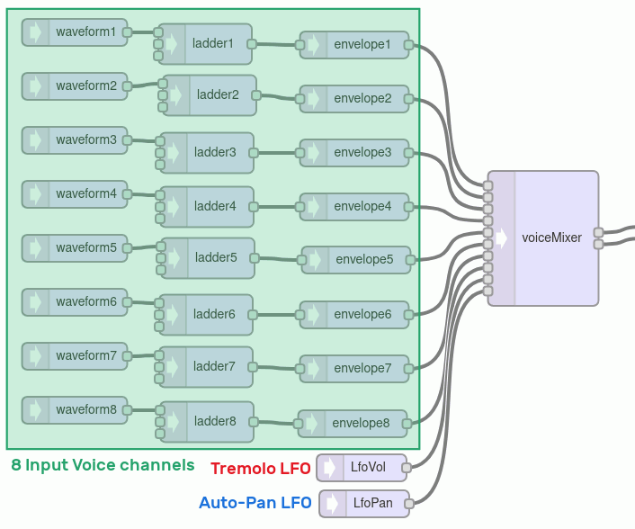
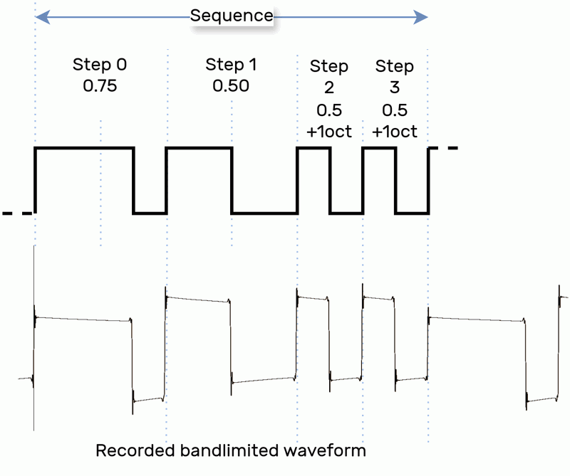

# hexefx_audiolib_i16
Audio effects library for Teensy4.x standard Audio Library.  
The effecs are ported from the main [floating point version of the library](https://github.com/hexeguitar/hexefx_audiolib_F32 "hexefx_audiolib_F32").  

### [GUI available HERE](https://hexeguitar.github.io/hexefx_audiolib_i16/gui/index.html "hexefx_audiolib_i16 GUI")  

## Effects  

### [Plate Reverb Stereo](PlateReverbStereo.md "Plate Reverb Stereo") 
### [Spring Reverb Stereo](SpringReverb.md "Spring Reverb Stereo") 
### [Reverb SC Stereo](ReverbSC.md "Reverb SC Stereo") 
### [Stereo Modulated Ping-Pong Delay](DelayStereo.md "Stereo Modulated Ping-Pong Delay")  
### Stereo 12 stage Phaser  

## Synth  

### 8 channel voice mixer with stereo output and modulation inputs  
Useful module for building polyphonic 8 voice synthesizers, mix all the voices at once instead of using cascaded 4 channel mixers. In addition, it provides two more modulation inputs: one for volume (tremolo effects) and one for panorama (auto-pan effect).  

### AudioWaveform generator extensions (sequenced PWM mode)    
enabling a waveform generator with option to sequence up to 4 steps with different PWM duty and octave setting.  

## Using with Arduino  

1. Locate the Arduino Sketchbook directory (path is shown in Preferences).
2. Enter the Sketchbook directory (ie. `/home/user/Arduino/`).
3. Create a new directory named `libraries` if it doesn't exist already. Enter it using a terminal or github CLI.
4. Clone the required library:  
   `git clone https://github.com/hexeguitar/hexefx_audiolib_i16.git`
   or alternatively, download the ZIP file and unpack the library there.
5. Restart the Arduino IDE. 
6. To use the audio library extensions within graphical design tool visit **[this link](https://hexeguitar.github.io/hexefx_audiolib_i16/gui/index.html "Graphical Design Tool")**. This version includes the default Teensy Audio library and the hexefx_audiolib_i16 extensions.  
7. If defining the components manually, make sure `Audio.h`and `hexefx_audiolib_i16.h` are included in the sketch file.   
---  
Copyright 12.2024 by Piotr Zapart  
www.hexefx.com

